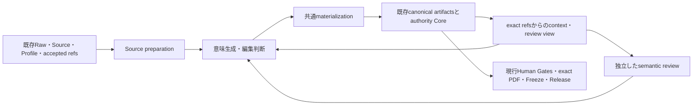

# Astra — architecture direction decision

日付: 2026-09-10 JST  
状態: **DIRECTION SELECTED / DESIGN PROPOSAL / NO PRODUCTION ADOPTION**

## 1. 推奨する変更幅

**authority Coreと既存canonical artifactの大部分を維持し、その手前のsemantic authoring / materialization層を共通の責任境界に沿って部分再設計する。** 新経路は既存Coreへ接続し、Profileごとに検証して段階的に置換する。個別修復の継続だけを長期戦略にせず、Core全体のclean-slate置換もしない。

ここでの再設計は新しい常駐サービスや第二のState engineを作ることではない。現在のedition別生成スクリプト、表現を狭めるinteractive入力、失われた情報を後から戻すwrapperを、**意味を作る処理と、決まった意味を無損失にmaterializeする処理へ分けて共通化する**ことである。in-place refactoringで達成できる部分はそれでよい。「置換」はファイル総入替えを意味しない。

前回の[feasibility結論](astra-semantic-handoff-feasibility.md)を次のように更新する。

- paperの狭い修復は有効な緊急／局所課題であり、新境界の最初の検証例にする。
- **次のarchitecture投資をpaper parser単体に限定しない。** source/model/Profileが変わるたび、別の都合のよい縮約とそれを補うreview・adapterを増やす構造を減らす。
- 新Consumption Record正本、五つの物理product、固定の三者model topologyは採用前提にしない。既存Card/View/Selection/Draft等が持つ情報をまず使う。

この変更幅が最も有望という判断の確度は中程度。反復する境界上の問題には実装Evidenceがあるが、長期の実働費、修復頻度、移行費の実測がないため、経済的最適性を証明したとは言わない。**方向の選定であり、production切替の承認ではない。**

## 2. 今回のEvidenceと、前回から判断を広げた理由

### 固定したproduction reality

開始時にremoteをread-only確認した。workspaceはlocal/remoteとも `49062159aa1e3ed1a80bf58bec27af1b9f3b91ed`、clean。前回workspaceからの追加はfeasibility報告・probe・結果JSONの3ファイルのみだった。

production mainは `6d748a962d57beff89da7c1b20cb5a9a86c8e261`、W34は `030eb723c12282f0cfd09aaada05d14f0c0906c7`、SP001は `1b19a98511f9717d04b3b8f95207599fcdb7f48d` で、前回から変更なし。前回の4 sliceのhash probeは再実行せず、固定Evidenceとして使用した。W34のSelectionは未実行というsnapshotを維持し、そこへの介入はしていない。

追加調査は、同じ境界問題がpaper以外にもあるか、authorityを残す費用と防ぐ失敗は何か、既存機能だけで改善できないか、という三つの問いに絞った。以下はソースコード・規範文書の直接read。新しいproduction出力の実行比較ではない。

| Evidence | 確認したこと | architecture上の意味／限界 |
|---|---|---|
| 前回4 slice | 保存済み意味・identityの多くはjoin可能。paperにはUI混入とtarget一律VERIFIEDがある | storage/authority不足とsemantic生成不良を別々に解く必要がある。全件の欠陥率は不明 |
| [Evidence interactive runner][evidence-runner] `_validate_record` / `_build_card` | canonical Cardは複数entity・metric・claim別sourceを表せるが、runnerは単一entity、共通source集合、空metricsへ制限 | canonical schemaを作り直す前にauthoring interfaceの表現力を直す余地。実際に非空metricを失った件数は未確認 |
| [agent-first Evidence entrypoint][agent-entry] L33–99 | hash-pinned canonical Discoveryを読み直してcompact acceptance viewへ戻し、Thematic residual limitationsをclosureへunionする。runner関数を一時差し替える | すでに正しい再利用がある一方、入口とconsumerの契約差をwrapperで補修している。wrapper自体をauthority bypassと非難する根拠はない |
| [Selection/Architecture runner][selection-runner] L48–54, L158–276 | 一つのinputにassignmentsとArchitectureを要求し、一回のrunでMatrix→Selection→Architectureを作る。Stateは進めない | 現在W34の「Selectionで止めてreview」という境界と、この便利な入口の粒度は一致しない。共通Coreには分離可能なfunctionが既にある |
| [Drafting/Synthesis runner][draft-runner] L95–190 | Discovery IDとmodeからcandidateのclaims/limitationsをまとめて参照。各must-cover requirementへ全non-heading blockを付与。METRIC参照のmodeがない | 意味的coverageをauthorが明示せず、形として広く付く経路。ここから実際の公開誤帰属を断定しないが、精密な診断／局所再利用の入力になりにくい |
| [Draft Core][draft-core] L461–512, L604–645 | EVENT/CLAIM/METRIC/LIMITATIONをindex化し、参照・coverage対象・boundary dispositionの構造を検査できる | canonical側の表現力を使う設計は可能。構造検査だけではentailmentや実際のcoverageを証明しない |
| [現行governance][governance] | semantic reviewは機械PASSと別。未選択、未消費、negative space、Human dossierを要求する | review責任は欠陥に対する必要な制御。自動生成の不備を恒久的にreviewで毎号埋める費用は別に評価すべき |
| [final audit rule][audit-rule]、[contract identity][identity] | exact候補の全監査、mutation後の全audit無効化、集約contract hash。trust bootstrapやhistorical Gateの具体的防御を規定 | 共通部変更には大きい検証費がある。ファイルが少ない修復でもこの費用が消えるとは限らず、反復修復を減らす投資価値がある |

W34 edition側のresume用driverは前回読んだとおり、既存Coreの呼出順を再記述している。上記agent-first wrapperも含め、すべての周辺scriptを無駄とみなすのではなく、**どの契約不一致を埋めているかを共通境界へ移せるか**を判断する。

**新しい推論:** paperに限らず、便利な入力からcanonical outputへ展開する際、詳細情報を省く・review時点をまとめる・意味的対応を機械的に広く付ける傾向が複数stageにある。この共通要因を処置する方が、parserを直し続けるだけより、将来変更に対する反復仕事を減らせる可能性が高い。

これは静的に確認した複数の設計境界からの推論である。これらの経路の実行頻度、現在どの入口が何割使われるか、全stageの発生事故率を測った結果ではない。

## 3. 比較した構成

| 構成 | Lifecycle上の利点 | 継続cost／移行cost | 判定 |
|---|---|---|---|
| A. 現構成を保ち、発見したdefectを都度repair | 歴史・運用との連続性。短命／変更の少ないsystemなら合理的 | producerごとの縮約・resume・profile対応とreview負担が残り得る。shared修復ごとのaudit費も反復 | 安全なfallback／緊急対応。長期の第一選択にはしない |
| A+. 新層を作らず、モデルにfull canonical Card等を直接書かせる | 現schemaの表現力をすぐ使える。過剰なcompact DSLを避ける | task/hash/basis/source照合やstage運用の細部が毎回のprompt／人手へ移ると再生成・handoffが増える | **強い比較相手。** Bの実装方式として一部採用可能。追加adapterの価値が無ければこれへ縮小 |
| B. authority/Coreを残し、authoringとmaterializationの境界を共通化 | losslessな意味payload、stageごとの停止、exact join、同じ局所検証をProfile横断で利用。edition救済scriptと後段再構成を廃止できる可能性 | interface設計、旧入口との互換性、共通化によるblast radius、初期の広いregression、一時的二重保守 | **推奨。中規模の部分再設計を段階導入** |
| C. semantic layer全体を別engineへ置換し、独自product model→legacy artifactsをadapterで投影 | scheduling、source cache、モデル切替を一元化しやすい可能性 | 第二のartifact意味モデル、全stage adapter、権限・状態の同期、欠落診断、長期legacy維持。既存の豊かなCard等を再発明する費用 | 現Evidenceでは過大。Bでは解けないcoordination costが示されたら再検討 |
| D. authority/Coreも含むclean-slate再構築 | 契約・状態モデルを根本から整理できる | trust bootstrap、Human revision、exact bytes、歴史検証の再実装・移行。長期二重運用。semantic errorが自動解消する理由はない | 不採用。Coreの防ぐ失敗を安く同等に防げる実証がない |

BとAの差は修正ファイル数ではなく、**新しいsourceやProfileを追加した際、意味を作る処理だけを変更できるか、それともmaterialization・review packet・resume・diagnosisも各所で直すか**である。通常のrefactorがBの境界を実現するなら、それを「repair」と呼んでも構わない。

### Lifecycle workの比較方法

将来の号数だけでなく、source形式・Profile・model・workflowの変更回数と、失敗の診断／修復費を含める。

同じ単位で比較可能なcost軸について、BとAの差は概念的に次で評価する。

```text
ΔW(B−A) = 初期設計・実装差
         + migration・一時的二重保守・歴史互換差
         + Σ scenario頻度 × (production + review + handoff + repair
                             + regeneration/CI + diagnosis + maintenance の差)
```

人のactive time、LLM usage、CI時間、費用を無根拠に単一単位へ換算しない。各軸で内訳を比較し、trade-offはHumanへ提示する。未知の頻度・削減量を仮の数字で埋めてROIを作らない。

- **少数の今後の号、source/Profileの変更が少ない:** A/A+の初期費優位が勝ち得る。Bを完成させること自体を目的にしない。
- **継続するWeeklyと多様なSpecial、source/model変更が反復:** 共通materializationと明示的semantic payloadの初期費を償却しやすい。現在の複数経路のずれはこのscenarioで不利になるEvidence。
- **coordination/並行実行が実測の主要cost:** Bのinterface整理だけでは不足しCが候補になる。しかし現時点でその支配性は観測していない。
- **新経路でHumanの裁定や細かい入力が増える:** LLM/CIが下がっても自動採用しない。A+やBの縮小版へ戻す。

一回のAstra creditsや今回の変更量が小さいことはAを選ぶ根拠にしない。一方、将来の削減がまだ仮説なので、大きな移行投資を今一括で確約もしない。Bの初期検証にはA+を対照として残す。

## 4. 推奨境界の具体像



図のboxは責任であり、同数のagent、service、schemaやartifactを追加する指示ではない。最初は同repository・既存runtime・通常functionで構成できるかを優先する。

### Source preparation

取得したRawと、解析しやすい本文を区別する。本文領域・source kind・抽出version・cutoff／truncationを明示し、正規化が意味的な確認完了を宣言しない。HTML UIの混入除去やlocator再発見はdeterministic処理に向くが、何がmaterialかをkeyword scoreで確定しない。

既存Raw/Supplementを再利用する。全sourceを新しい永続databaseへ移さない。derived textを保存する場合は再生成可能なcacheか、正本に必要なprovenanceかを区別し、Rawとのexact対応を持つ。古い外部bytesが無いSpecial observationは、あるかのように補完しない。

### Semantic authoring

authorが書くのは、claim/metric/subject/comparator/source support、未確認範囲、target finding、materiality/selection rationale、原稿blockの根拠とcoverage等の**意味的な差分**。hash計算・ID探索・重複JSONの組立てをauthorへ押し戻さない。

入力は可能な限り既存canonical schemaのsemantic部分を用いる。「full canonicalを直接出す」経路と「最小semantic payloadを出して機械部分だけ補う」経路を比較し、後者が別の大きなDSLになるなら前者を選ぶ。意味情報を縮約してから後で推論し直すround-tripは避ける。

本文にspanがあることと、claimを支えることは別。未記録のlocator・比較条件・時点・判定根拠はmissing/unknownとし、materializerが埋めない。全候補で最大詳細を強制せず、その問いに必要な範囲を記録する。

### 共通materializationと既存Core

| Operationの論理境界 | authorが決めること | deterministic側で処理すること | 自動で決めないこと |
|---|---|---|---|
| Evidence | entities、各claim/metricのsupport、verification finding | exact task/source照合、basis/ID付与、canonical Card validation | target VERIFIED、materiality、全文消費の認定 |
| Edition View | current Profileへの意味、rationale、残余境界 | exact Card binding、Profile fieldsの保存 | 他号のacceptanceの継承 |
| Selection | 採否、role、cluster、理由 | Discovery→candidate一意照合、exact inherited fields、既存validation | statusだけからの採否、Architectureの先行生成 |
| Architecture | thesis、package、allocation、omissions | 参照・basis・既存境界の保存 | Human approval |
| Draft | prose、claim/metric別refs、実際のrequirement対応 | exact approved package内のrefs解決、構造validation | 全claimを全blockへ付けることによるcoverage認定 |

Operationはstageごとに呼べて停止可能にする。複数stageを一括実行する便利な入口を残す場合も、既に与えられた意味決定と現行review境界の範囲でのみcompositionする。一体型runnerに合わせてreviewを後回しにしない。

新materializerに独自のactive Stateやapproval storeは持たせない。**意味を受け付けること、canonical artifactを作ること、stageを受理すること、Humanが承認することは別operation**である。

### Context / review / role

existing active refsから短いviewを生成し、Card/View/Rawへの正確な参照を付ける。viewが短いことを意味情報の消去と混同しない。Missing/stale、provisional、reviewed、Human-approvedを区別する。

編集の継続責任は一つにし、物理的に巨大なchat transcriptを一つ維持する要件にはしない。bounded workersが意味生成やdraftを行い、非著者のreviewがそれを検証する。model familyや三人目の常駐は固定しない。model変更で変える部分はinvocation/capability設定と評価であり、canonical artifactやHuman authorityをmodel名に結び付けない。

初期移行では現行#485のreview責任・停止点を維持する。将来reviewをまとめる／減らす場合は、source-backed omission、未選択、強いcounterexample、semantic escapeと全roleの費用を測る別判断を要する。schema改善をreview削減の理由にしない。

## 5. Safety mechanismをどう評価したか

| Mechanism | 防ぐfailure | 維持に掛かるcost | 推奨 |
|---|---|---|---|
| exact source/task/contract/hash binding | 別source、別task、古い契約やbytesの混入 | hashing、lookup、参照解決、保管 | 保持。共通resolverで利用者の探索を減らす。bindingとentailmentを分離 |
| machine validationとsemantic reviewの分離 | 形式PASSが研究／編集のPASSを偽装 | independentな再読・negative-space確認 | 保持。生成不良の事後救済を減らし、必要な独立確認まで消さない |
| Human Gateのexact reviewed commit、到達可能性、revision/invalidation | stale承認、別bytes、上流修正後も旧approval継続 | durable snapshots、再review、複雑なrevision handling | 保持。historicalとactive authorityの区別を新層も遵守 |
| exact PDF / Freeze / Releaseと公開後照合 | 再build drift、承認していないPDF公開、外部公開とStateの不一致 | storage、hash比較、reconciliation | 保持。release adoptionの既知接続不一致は独立maintenance。機構削除で帳尻を合わせない |
| default-branch trust root、事前admission、隔離runtime、lease-bound write | 未審査work-branch code実行、権限昇格、競合上書き | 別runtime・preflight・workflow回帰検証 | 保持。新source/model plug-inを理由に未信頼codeへwrite権限を渡さない |
| 全候補coverageとProfile/temporal分離 | silent drop、Weeklyの前提をSpecialへ持込、時点の混同 | record bookkeeping、cross-profile tests | 保持。正確なProjectionで作業を共通化 |
| broad contract hashと全fixed-head audit | 未把握の依存・変更を旧PASSで通す | 無関係に見える変更でも再監査し得る | 現行は維持。将来の実測と依存証明で粒度変更を別途評価。BのROIにaudit緩和を先取りしない |

安全制御の**目的**は残すが、現実装の全wrapper・重複文書・状態表示を永久保存するのではない。同じ保証を一つの共通実装で提供できる部分は統合候補になる。逆にexact historical bytesやreview snapshotは、冗長に見えても履歴検証の資産であり廃止対象ではない。

release helperは今回もexact-byte reconciliation reviewを作る実装を確認した。[Release helper][release-helper] 過去W33/SP001で報告されたstage contractとの不一致は前回までのEvidenceを引き継ぐ。今回はreleaseの実行／再監査をしていない。これをsemantic layer再設計に抱き合わせず、緊急性があれば独立してHumanが優先付けできる。

## 6. 維持・統合・置換・廃止候補

| 対象 | Targetでの扱い | 廃止／縮小できる条件 |
|---|---|---|
| accepted Card/View/Selection/Draft、Profile、State、Gates | 原則維持 | schema不足が実例で示されたfieldだけ変更候補。まとめて別productへ移さない |
| 既存Core validatorsとcanonical derivation | 再利用・共通入口化 | invariantの同等性確認なく置換しない |
| paper keyword→claim、target一律PASS、CONTEXT自動固定の意味生成 | 置換対象 | source-backedなbounded authoringとreviewが同じ問いを処理できること |
| 単一entity／空metrics等へ狭めるinteractive変換 | losslessなauthoring経路へ統合 | canonical表現力、old inputの扱い、missingの明示が検証されること |
| candidate単位で全refs／全coverageを付ける便宜処理 | 明示されたstatement/block対応のmaterializationへ | 局所refと比較条件を維持でき、author負担の増加が許容できること |
| stageを結合するrunner | stage別operationsのcompositionへ | 既存のstop/review timingを守り、個別呼出と一括呼出が同じ結果を持つこと |
| canonical情報を復元するwrapper、edition resume driver | 必要な機能を共通resolver/materializerへ移す | 実際の旧callerを切替え、そのwrapperを新productionで不要にできること |
| consumption ledger/details | 既存provenanceとして保持。新規生成はfield用途を整理 | 独立したconsumed合格証を廃止し、必要traceが失われないこと。Raw範囲など固有情報まで削らない |
| 手書きcurrent status／重複handoff JSON | generated view候補 | 正本から必要な意味・authorityへ到達できること |

単に新wrapperを一枚足し、全旧経路を永続保守するならBの狙いを達成していない。各統合単位に「新たに増えるもの」と「新productionから外せる旧writer/caller」を対で示す。historical再現用の古い実装保存と、今後も旧経路を通常運用することは区別する。

## 7. Migration / compatibilityに必要な費用と制約

採用する場合でも、一括migrationは勧めない。

1. **設計・隔離比較:** 既存canonical objectsへの適合を、paper失敗例、C019/C033、Thematic context、metric/comparator、stage停止で比較する。A+直接authoringを対照に置く。legacy input archiveは不変で、評価出力はauthorityに接続しない。
2. **Human承認後の限定導入:** future editionの対象Profile・stageでproducer/materializer versionを固定する。既に進行中のW34やfrozen SP001を、移行実績を作るために書き換えない。
3. **one writer:** 同じedition/stageのcanonical outputへ旧新が同時writeしない。比較armの出力は隔離し、採用する経路だけが既存Core acceptanceへ進む。既存request、current basis、stage validationを迂回しない。
4. **段階的な適用拡大:** まず研究側の一経路、次にreview timingに対応したSelection、その後Draftの詳細refsを、独立に検証して広げる。WEEKLY成功をTHEMATIC/RETROSPECTIVE_PERIOD成功に換算しない。
5. **retirement:** 置換済みcaller、重複driverを新productionの推奨経路から外す。旧版はfixed commit／既存履歴として保持し、通常の新経路からは呼ばない。適用未検証Profileの旧routeは例外として明示し、隠さない。

新たなcostは、interface/fixtureの設計、compatibility変換、trusted runtime統合、cross-profile regression、操作文書と教育、source-parser保守、producer version記録、移行期間のdual-read診断、retirement確認である。最初のshared変更は広い影響を持ち、current auditの負担も掛かる。これを「小さなadapter」だから無料とは扱わない。

rollbackも無条件ではない。未受理のcandidateなら旧経路に戻せるが、受理後／Gate後の修正は現行invalidation・revisionを使う。新semantic resultのaccepted directoryへ旧resultを上書きしたり、古いHuman approvalを新bytesへ付け替えたりしない。

歴史互換は**旧成果を新形式へbackfillすることではなく、旧ref・contract・Raw/PDF・approvalがそのまま再検証可能であること**をまず守る。別号への意味の入力再利用は許容候補だが、authority acceptanceは新しく取得する。Sourceの新capture、質問の変更、未記録条件には再読が必要で、global semantic cacheを今回のtargetに含めない。

## 8. 不確実性と方向転換条件

| 新Evidence | 判断をどう変えるか |
|---|---|
| A+の直接canonical authoringだけで同等品質・低い全role負担になり、別materializerの価値が無い | Bを縮小し、既存resolverと直接入力を整える。共通層の新設を中止 |
| 不具合がpaperの特殊な生成処理にほぼ限定され、他経路は使われず将来変更も少ない | Aのbounded repairを長期選択へ戻す。使われないrunnerの整理は別に評価 |
| 新semantic inputが長大になり、人間／モデルの転記・レビューが増え、旧経路を廃止できない | Bのinterfaceを簡素化または却下。複雑さを上流へ移しただけと判定 |
| canonical contracts自体がsemantic表現に必要な情報を失う／互換adapterが反復再判断を要求する | 部分schema変更またはCの限定範囲を再検討。Core全体置換へは飛躍しない |
| coordination、CI再実行、全auditが実測で主要costを支配し、Bの削減余地が小さい | 依存境界・pure transformationの再利用・audit証拠再利用へ優先投資を変更。Gate/semantic approvalのcache化とは区別 |
| migrationでhidden consumer、historical drift、Profile差分消失が出る | 当該route拡大を止め、同等性を修復または旧経路を維持。critical safetyを費用と相殺しない |
| fresh outputで重大omission/誤帰属が残る、またはreview削減でescapeが増える | review強度を維持／復元し、producer改善を再評価。情報構造の整備だけで採用しない |
| 長期運用量／変更頻度がHumanの計画上小さくなる | 初期投資の償却条件を再計算し、A/A+を優先する可能性 |

未確定なのは、各entrypointの実使用比率、source-specific semantic判断の費用、full canonical authoringの負担、Profile拡張で本当に消える作業、実行環境・usage内訳、移行中の二重保守期間である。これらを観測せずに「Bで何%削減」とは言わない。

## 9. 次に実行すべき仕事

次は **「semantic authoringとmaterializationの共通境界の詳細設計・契約適合性評価」** を一つの設計／validation Phaseとして推奨する。paper parser単体のpatch実装や、全layerのprototypeへ直行しない。

そのPhaseが出すべきdecision surfaceは次のもの。

- **A+とBの具体的な一往復:** 同じsource/taskから、authorが記入するpayload、機械が補うfields、既存canonical output、review viewまでを示す。別の独立正本を作らずに成立するか比較する。
- **境界の反例:** UI混入、未確認target、metric/comparator／claim別source、未消費、時点の異なるSpecial、Selectionだけで停止、Draftの特定claimと特定blockの対応。内容の正しさをschema testで代替しない。
- **entrypointとretirementの設計:** canonical functionをどこまで直接利用できるか、wrapperのどの機能を統合するか、実際に外せるcallerはどれか。隠れたconsumerがあればそこだけ追う。
- **仕事の比較:** author入力、参照探索、review裁定、repair、projection保守、migration・互換の内訳。最初は代表的な一往復の実作業または明示的task inventoryで比較し、quality非劣化や全production ROIの証明とは呼ばない。

設計が示すのが「losslessな共通境界の成立＋廃止対象あり」なら、Humanが次に隔離実装・局所検証への投資を判断できる。A+で十分ならそこで縮小する。必要情報を元schemaでも表現できなければ、その不足だけ設計し直す。

これは次Phaseの推奨であり、今回そのprototypeやsource再生成を実行したという意味ではない。現時点で明らかなpaper findingのproduction優先度・対応はHumanと担当review roleに残し、architecture設計完了まで緊急maintenanceを待たせる規則も作らない。

## 10. 今回の終了判断

比較のために必要だった具体性は揃った。既存Coreに豊かな表現と実績ある安全境界があること、その手前の複数stageで便宜的な縮約／結合を行うこと、取り得る変更幅とmigration費、A+へ縮小する条件まで示せた。追加の全repo auditや新たなモデル／framework調査は、現在の主要方向を変える見込みが低い。

本書をdurable resultとして停止する。新規保存は本書のみ。production repository、State、Human decisions、Gates、Publication Preview、Freeze、Release、production adoption/migrationは変更していない。Pull/Push、model比較、prototype実装、shadow runも行っていない。

[evidence-runner]: https://github.com/eariver/japanese-generative-ai-survey/blob/6d748a962d57beff89da7c1b20cb5a9a86c8e261/scripts/run_evidence_v2_interactive.py#L302
[agent-entry]: https://github.com/eariver/japanese-generative-ai-survey/blob/6d748a962d57beff89da7c1b20cb5a9a86c8e261/scripts/run_evidence_v2_agent_first.py#L33
[selection-runner]: https://github.com/eariver/japanese-generative-ai-survey/blob/6d748a962d57beff89da7c1b20cb5a9a86c8e261/scripts/run_selection_architecture_v2_interactive.py#L158
[draft-runner]: https://github.com/eariver/japanese-generative-ai-survey/blob/6d748a962d57beff89da7c1b20cb5a9a86c8e261/scripts/run_drafting_synthesis_v2_interactive.py#L95
[draft-core]: https://github.com/eariver/japanese-generative-ai-survey/blob/6d748a962d57beff89da7c1b20cb5a9a86c8e261/scripts/survey_drafting_v2_base.py#L461
[governance]: https://github.com/eariver/japanese-generative-ai-survey/blob/6d748a962d57beff89da7c1b20cb5a9a86c8e261/docs/survey-production-core-v2-sol-luna-review-governance.md
[audit-rule]: https://github.com/eariver/japanese-generative-ai-survey/blob/6d748a962d57beff89da7c1b20cb5a9a86c8e261/docs/survey-production-core-v2-final-audit-rule.md
[identity]: https://github.com/eariver/japanese-generative-ai-survey/blob/6d748a962d57beff89da7c1b20cb5a9a86c8e261/scripts/survey_production_v2.py#L150
[release-helper]: https://github.com/eariver/japanese-generative-ai-survey/blob/6d748a962d57beff89da7c1b20cb5a9a86c8e261/scripts/survey_release_checkpoint_v2.py#L22
