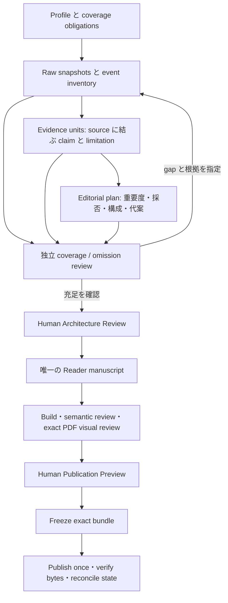

# Phase A — Generative AI Survey architecture reconstruction

作成日: 2026-09-09 JST  
状態: **Phase A 完了・独立レビュー用提案。production の運用規則変更や実装を承認する文書ではない。**  
作業場所: `eariver/reconstruct-japanese-generative-ai-survey`

## 1. 結論

推奨するのは、現在の Core を全面置換することではなく、**研究で得た意味内容と編集判断を再利用できる単位にし、そこから機械成果物・レビュー画面・再開情報を生成する構造**への再編である。

現在は「正しい資料を取得し、正しい hash で結び、すべての候補に disposition を記録した」という証明が、「その資料を十分に読んで読者に必要な内容を選んだ」という証明より強く整備されている。W34 はこの差を実際に示す。修復後も本文取得と意味抽出が分離し、形式上の改善が編集上の改善に伝播しなかった。一方、形式と承認の厳密さ自体には、異なる PDF の公開や誤った承認の再利用を防ぐ実績上の理由がある。[E2][E3][E4][E5]

変更の優先順位は次のとおり。

1. **Evidence の情報価値を修復する。** 資料取得・claim の抽出・claim の確からしさ・号への重要度を別々に表現し、本文を読んだ結果を残す。取得後も古い「未取得」理由を引き継ぐ運用を止める。
2. **編集責任を一つにする。** Editorial Lead が重要度、採否、構成、読者向け原稿を継続して所有する。Execution/Research Worker に暫定判断を全段階で作らせ、Lead が同じ判断を作り直すことを標準経路から外す。
3. **独立性は維持し、再読を重点化する。** 独立 Reviewer は必ず coverage と omission を点検し、重大 claim・未採用の強い候補・変化した領域の一次資料を直接調べる。すべての段階を再実行する第二の編纂者にはしない。
4. **変更の影響範囲と承認対象を明示する。** 既存の stage 単位の invalidation を出発点に、候補・claim・原稿の依存単位へ狭める。Human の exact review identity と公開する PDF の exact bytes は維持する。
5. **保守上の増幅を別に減らす。** 現在状態の手書き重複、広範囲 contract hash、毎回ゼロからの全 Core 監査、公開後の個別修復を、生成 view・変更影響判定・共通 release reconciliation に置き換える。

この順番が重要である。キャッシュや workflow engine を先に導入すると、情報の薄い Evidence を高速に再利用する危険がある。省力化の最大の仮説は「モデルを安くする」ことではなく、**一度行った有用な作業を後段が信頼可能な形で消費できるようにすること**にある。

## 2. 調査範囲と証拠の扱い

root `AGENTS.md` と指定された六資料を読み、GitHub の branch API とローカル Git object を突き合わせた。調査時点の remote main は `0a47a9b85108c5a2e9644037e7c0fb48b5bd96dc`、W34 は `993583e871bcbfea7bfe700fe5c6f2648e8887c0` で、背景資料の SHA と一致した。ローカル production checkout は main と一致し、開始時の `git status --short` は空だった。

重点調査は、現行 config・authority・governance・final audit・改善計画、Evidence/agent control/Human Gate/release 実装、W34 の受理成果物と revision、PR #483–485、W33/SP001 の release と preview 修復記録である。外部調査は、依存キャッシュ、provenance、durable workflow、GitHub の trust boundary に限定した。production command、workflow dispatch、承認記録、push、merge は実施していない。

以下では「観測」はコード・固定 SHA の artifact・PR に確認できること、「診断」はそれらからの推論、「提案」は未実装の設計と区別する。PR 本文は経緯の証拠であり、その PASS 宣言だけを現在の正しさの証明にはしていない。

**限界:** LLM の全会話、完全な token/credit accounting、実働時間の計測はない。W33/SP001 の完成 PDF を今回独立に全ページ再審査したわけでもない。品質事例は修復記録と原稿構造から確認した。したがって、現行の絶対コスト、達成済みの削減率、最適な reviewer sampling 率は主張しない。調査方法と再現可能な小規模 probe は [証拠ノート](../notes/phase-a-evidence.md) に記載した。

## 3. 現在のシステムは何をしているか

### 3.1 End-to-end model

現行は既に agent-first であり、すべてを stage 間 handoff にした工場ではない。config の `handoff_required` は全 stage で false、direct local CLI が優先される。11 lifecycle state、二つの通常 Human Gate、research/publication の直交する Profile がある。[E1]

| 境界 | 内容・成果物 | 主な authority |
|---|---|---|
| Initialize | Weekly cutoff、Period、Thematic scope、publication profile、work branch を確定 | Profile / Production State |
| Source Intake / Discovery | collector、外部 X/Grok、追加検索、Raw 保存、候補 inventory、coverage 確認 | exact Raw / accepted Discovery |
| Screening | event identity の分割・重複整理、KEEP/MAYBE/INSPECT/DROP | accepted Screening と checkpoint |
| Evidence / Materiality / Completeness | non-DROP の task、資料・claim、号別 view、重要度、残余 gap | accepted Evidence / Views、ledger、completeness |
| Selection / Architecture | candidate matrix、採否、package、構成、page plan、review summary/attention | artifact basis の hash 連鎖 |
| Architecture Review | coverage、資料消費、重要な候補・除外、構成、代案を Human に提示 | committed State/Gate bytes と reviewed commit、明示 decision |
| Draft / Synthesis / Reader publication | 内部 draft と synthesis、独立した読者向け source、TeX/PDF | source / semantic / visual review |
| Publication Preview | exact Candidate が source、PDF、適用 quality、review を束ねる | Human が見た Candidate/PDF bytes |
| Freeze / integration / Release | 承認 PDF の保持、main への edition 統合、外部 release、download 再照合、状態採用 | freeze、manifest、merge verification、release record |

通常の機械遷移は stage contract report と compact checkpoint を検証して State を進める。過去の accepted directory を「最新らしさ」で選ばず、checkpoint が指す active authority を読む。この仕組みは残すべき出発点である。[E1][E6]

Weekly は期間内の意味、carry-over、late-breaking、why-this-week を扱う。Period Special は期間・chronology・横断 synthesis、Thematic Special は問い・系譜・競合・反例・as-of を扱う。LONGFORM は通常 narrative の二段組と wide な比較・Technical Notes 等を区別する。SP001 の完成 source にも複数系譜と比較・総括があり、Special を「長い Weekly」に統合すべきではない。[E1][E11] 全ページ visual PASS でも一段組への回帰を見逃した実例は [PR #475](https://github.com/eariver/japanese-generative-ai-survey/pull/475) に記録されている。

### 3.2 Production と Core maintenance は異なる経路

Production は edition-local 修復を自律実行し、共通 Core defect は別の保守変更として扱う。Core maintenance は candidate を固定し、七観点をゼロから監査し、candidate tree に変更があれば監査全体を失効させる。この規則を、すべての edition stage で全監査しているかのように混同してはいけない。[E7]

Connector bridge は更に別の **transport/trust adapter** である。default branch の trusted workflow、read-only preflight、隔離された reviewed-main runtime、request-only commit、branch head の再検査、lease-bound writeback がある。PR transport は Human approval でも integration PR でもない。direct CLI の環境にこの transport 手続きを持ち込む理由はない。[E1][E7]

## 4. Work amplification の診断

### 4.1 意味抽出の不足が後段すべてへ伝播する

**観測:** W34 の初回 80 Evidence は全件 PARTIAL、号別重要度は MATERIAL 1 / CONTEXT 45 / HOLD 34、Selection は 1 / 64 / 15 だった。本文追加と PR #484 後、Evidence は VERIFIED 32 / PARTIAL 27 / NEEDS_MORE 14 / REJECTED 7 に変わったが、MATERIAL は依然 1、Selection も同じだった。[E2][E3]

**診断:** source admission の改善と semantic extraction の改善が別工程になっている。Evidence が不十分なまま Materiality → Selection → Architecture へ流れると、後段は正しく保守的であるほど少量の情報に収束する。その後の修復は source だけでなく view、ledger、matrix、selection、architecture、checkpoint、Human surface の再生成を要求する。

### 4.2 二重の判断と二重の説明

PR #485 は独立 supervisor に Discovery、本文消費、gap-fill、重要度、Selection、Architecture、dossier の責任を置いた。これは欠陥を検出するために必要な回復策だが、Execution 側にも暫定 Evidence/View/Materiality/Completeness が必要なので、役割間で同じ判断を再構成しやすい。[E4]

これは「全 source が常に二度読まれる」と測定したものではない。**契約上重なりがある**ことと、W34 の複数回の再生成は観測できるが、実際の再読 token は未測定である。必要な独立検証を duplicate work として丸ごと削るのも誤りである。除くべきなのは同じ表現への詰め直し、古い説明の継承、全 stage の意味判断を二者で作ることだ。

### 4.3 手書きの現在状態が authority reconciliation を生む

W34 最新 State は `CANDIDATES_NORMALIZED` だが、同じ SHA の `execution/index.md` は `ARCHITECTURE_ESTABLISHED` / Human review ready の古い説明を保持する。main の authority index も #484 時点の main SHA、改善計画も #483 draft/unmerged の記述を保持する。実態優先の precedence が救済するが、新セッションは都度矛盾を解決しなければならない。[E1][E2][E8]

PR #483 では六観点/七観点の記述不一致、既公開 W33 を将来の検証対象とした記述により candidate audit が失効したと記録される。安全確認が必要だったことと、変動 status を複数の規範文書へ埋め込む設計が効率的であることは別問題である。[E8]

### 4.4 依存はあるが、粒度が広い

現行 `contract_identity()` は config の pipeline 62 files に config/Profile/State schema を追加した集合を aggregate hash にする。stage checkpoint は実行 checkout SHA、現行 contract、State/Profile、成果物を束ねる。正確な由来を示す一方、文書・契約・実装・実行状態の変更を整理する負担が大きい。[E6]

既存 checkpoint は過去の実装を保持でき、単に HEAD が動くだけで全過去成果が無効になるわけではない。問題は **新しい遷移・再生成に必要な依存証明と全体 contract の結合**、および保守監査で全 tree mutation を同等に扱う点である。Stage 単位の rollback は既に実装されているので、新設ではなく分解と再利用を提案する。

### 4.5 Shared defect の再発を edition ごとに吸収している

SP001 #478 と W33 #482 は同じ事象を記録する。公開 PDF は exact bytes で公開されたが、release helper が `CORE_STAGE_CONTRACT` review を出さず、State の FROZEN→RELEASED 採用に失敗し、別の bounded recovery が必要になった。[SP001 #478](https://github.com/eariver/japanese-generative-ai-survey/pull/478)、[W33 #482](https://github.com/eariver/japanese-generative-ai-survey/pull/482)。

main の helper は今回の静的確認でも `RELEASE_EXACT_BYTE_RECONCILIATION` のみを生成し、consumer は `_validate_core_stage_report()` を要求する。実運用を再実行してはいないが、記録された producer/consumer 不一致を現行コードでも説明できる。[E9]

これは agent の能力や source 数とは無関係な保守の問題である。安全な read-only boundary を守ることと、既知 defect の修復を毎号の runtime alignment に委ねることを区別すべきである。

## 5. W34 の品質失敗を再構成する

### 5.1 確認した因果系列

| 時点・証拠 | 確認できる結果 | 示唆 |
|---|---|---|
| 初回 Evidence→Architecture worklog | 80 PARTIAL、MATERIAL 1、selected 1、validator PASS | 形式適合は調査充足を含意しない |
| 本文追加後の accepted set `377134…` | VERIFIED 32、しかし MATERIAL 1 と sparse Selection を維持 | 取得・binding 改善が意味抽出へ届いていない |
| C019 Mistral の card と Raw | substantive 本文を保存しつつ「exact page bytes がない」と記述 | limitation が source の現状を表していない |
| `bc092172…` の Architecture | target 2 pages / max 3、package 1 | 「約二ページ」は推測だけでなく plan に存在する |
| Architecture r2 Human REQUEST_CHANGES | ISSUE_INITIALIZED へ戻し、coverage・消費を再評価 | 人間が最終構成だけでなく研究の前提を差し戻した |
| Discovery r2→最新 Screening | fresh 439、KEEP 73 / MAYBE 136 / INSPECT 200 / DROP 30 | 現在は再調査中。古い sparse 案は active でない |

二ページの **最終公開物** が作られたと主張してはいけない。確認できたのは Architecture plan であり、最新 W34 に Selection/Architecture の再実行は認可されていない。[E2][E3][E10]

### 5.2 C019 は status と意味内容の乖離を直接示す

`task-089aea0f0b318bee50b2.json` は Mistral Agentic Search の status を VERIFIED とする。しかし claim は locator と chronology の汎用説明で、limitation は本文未取得を述べ、verification target は UNRESOLVED のままである。Supplement は同じ候補に 263,578 bytes の HTML と SHA-256 `286195a9673f8ed169a192bb3ac9c4a192c6b938e029ddc5eefd9619cacefd01` を結び付ける。[E3]

保存 HTML の本文には multi-step retrieval、既存 index の利用、search/open/navigate/read/grep、提供形態、publisher-reported benchmark といった候補固有の情報がある。これらを vendor claim として限定的に表現する余地はある。ベンチマークを独立再現した事実へ格上げする必要はない。**「発表者がこう主張する」と「独立検証済み」を分けたまま、読者に有用な説明は作れる。**

小規模 probe ではこの accepted set の 80 cards 全件の claim 数が 2、VERIFIED 32 件中 31 件は全 verification targets が UNRESOLVED だった。これは意味的欠陥の有力な警報であり、claim 数 2 を禁止する根拠ではない。status が event existence を指し target が別の技術的 claim を指すケースはあり得るため、enum の機械的不一致だけで全31件を誤りとは断定しない。C019 では本文と limitation の直接矛盾が診断を補強する。

### 5.3 なぜ遅く見つかったか

1. Raw の存在と source class を、source の意味内容を消費したことから十分区別していなかった。
2. 不確実な performance claim と、確定可能な release/capability claim を候補全体の HOLD にまとめやすかった。
3. 候補が全件処理されても、汎用 limitation の反復なら omission の合理性は証明されない。
4. LIMITED の明示は正直さを示すが、解消すべき gap を未処理のまま Gate へ送る免罪符にもなり得る。
5. Human-facing summary が status 中心だと、Human が source map・除外・代案を見るまで失敗が顕在化しない。

さらに coverage 自体にも別問題があった。Discovery r2 の独立 review は、以前の arXiv の説明不足な八 ID 抽出を指摘し、2,296 unique entries の全 triage chain を露出させた。314 shortlist は score rule による provisional membership であり semantic approval ではないと明記する。[E10] したがって「一回うまく抽出した Evidence を cache すれば解決」でもない。候補 inventory の外を調べる独立 coverage review が必要である。

## 6. 比較した architecture alternatives

| 案 | 利点 | 総仕事量・品質上の弱点 | 判断 |
|---|---|---|---|
| A. #485 を維持し全段階で supervisor の再読を強化 | 直近の事故に強く、移行が小さい | source 消費の不足を後から補う。二重判断と再生成は残る | 移行中の安全基準として保持 |
| B. 高能力の一 agent に研究から公開まで統合 | handoff と context 再構築を減らす | 自己確認と omission の共通盲点。W34 型の誤前提を Human へ直送し得る | 標準にはしない |
| C. Editorial Lead + bounded workers + independent critic、共有 semantic products | 意味判断の owner と reuse を一致させ、独立性を要所に保持 | semantic product と影響範囲が不完全なら cache が事故を広げる | **推奨** |
| D. Temporal/DVC 等を軸に Core 全面再構築 | durable execution や DAG/cache を既製機能へ移せる | editorial insufficiency を解決せず adapter、runtime、移行負担を増す | 全面導入は見送る。狭い機械処理で検証 |

現在の二役を固定の二つの agent に縛る必要はない。独立 Reviewer の能力と権限の分離を守り、workers の人数・モデルは workload に応じて変える。実際に最新 W34 worklog も execution role の model substitution experiment を記録しており、背景資料のモデル binding が不変ではない。ただし **Reviewer を anomaly 発生時だけ呼ぶ案は採らない**。検出器自身が未知の欠落を見逃すため、通常経路にも独立 coverage/omission review を残す。

## 7. 推奨 target architecture

### 7.1 役割と authority

| 役割 | 所有する判断・成果 | しないこと |
|---|---|---|
| Editorial Lead | research question、重要度、gap の優先順位と停止理由、採否・代案・構成、読者向け原稿 | 自分の重要判断の独立検証を自己承認で代替しない |
| Research/Execution Worker | bounded retrieval、exact Raw、候補固有の claim 抽出、資料に基づく限界、build/変換 | 未読を非重要へ変換しない。Human authority を作らない |
| Independent Reviewer | fresh coverage sweep、強い未採用候補、主張帰属、圧縮・歪み、最終原稿/PDF の検証 | 全 stage の成果物をもう一式作らない |
| Deterministic Core | identities、schema、依存・invalidation、generated views、state、権限、build、exact-byte release | sufficiency や読みやすさを count/PASS から判定しない |
| Human Decision Authority | Architecture と exact Publication Preview の明示承認/変更要求、真の scope exception | 通常の retry・資料取り寄せ・内部レビューの承認者にしない |

モデル名は execution provenance と比較実験の metadata にのみ保存する。Reviewer は generator と独立した review context で資料を選べること、Raw への直接 access を持つこと、blocking finding で progression を止められることが必要。同じ vendor/model family でも運用できるが、同じモデル由来の相関した盲点は residual risk とする。

### 7.2 正本を五種類の論理 product に絞る

これは五ファイルへの物理的統合ではなく、**同じ意味を人が何度も編集しないための owner 境界**である。

1. **Research basis:** Profile、coverage obligations、event identity、source snapshots、取得履歴。URL、取得日時、原公開日時・更新日時、event date とその確度を区別する。base/supplement は origin metadata とし、同じ admission 経路を使う。
2. **Evidence units:** source digest と本文位置、entity/variant/comparator、candidate-local claims、支持・反証、publisher claim/observed fact/inference、未解決事項、消費範囲を保存する。source に対して一度作った factual extraction を edition をまたいで利用可能にする。
3. **Edition editorial plan:** 全候補の disposition と coverage、重要度、package、thesis、claim の採用範囲、長さ・配置、omit/merge の理由、代案を一つの正本で扱う。Matrix、Selection、Materiality Ledger、review dossier は原則この正本と Evidence から生成する。
4. **Reader manuscript:** 読者向け prose の唯一の正本。claim ID を根拠へ結ぶ。内部 Evidence/Draft を文章の fallback に使わない。必要な内部 draft は作業 cache とし、別の編集正本として保守しない。
5. **Review/release bundle:** exact plan または exact source/PDF、review findings、明示 Human decisions、contract/tool provenance、公開結果。承認履歴は immutable に保ち、active pointer を一つ持つ。

Source に対する一般 claim と号への重要度は分ける。同じ source bytes でも、次の Weekly での materiality、Thematic の問い、as-of が変われば editorial judgment は再評価する。消費した範囲を記録しても「全文にあるすべての重要 claim を抽出済み」とはみなさない。必要な問いが変われば再読する。

ループはすべての source の recollection を意味しない。新しい根拠が必要な claim、欠けた lane、誤った event identity を指定して戻る。

### 7.3 標準 Weekly/Special 経路

1. State から生成した resume view を読み、対象 Profile・既承認 boundary・次の仕事を確定する。normative policy 全史を毎回読む必要をなくす。
2. Lead が coverage obligations と編集上の問いを置く。Weekly は期間・主要 lane・carry-over、Special は chronology/lineage/比較軸・反例・scope を置く。期待 page 数を先に採否の quota にしない。
3. Workers が広く intake し、重複・対象外の機械的整理後に semantic Screening を行う。弱い候補には軽い根拠で disposition、material/plausibly material 候補には substantive Evidence を作る。高い収集件数自体は成功条件にしない。
4. Lead は Evidence が揃うごとに claim と materiality を判断し、具体的 gap を返す。重要候補の最初の batch で本文消費を review し、全件に template defect を増殖させる前に止める。research status と editorial disposition を一緒に更新する。
5. Independent Reviewer は Discovery inventory 外の sweep、重要 claim、強い omission、systematic placeholder、真に sparse かを検証する。通常 path の Architecture critique に必須とし、高リスクなら Evidence 中に早期介入する。新しい根拠を読んだ結果だけを feedback し、全 dossier を書き直さない。
6. plan から dossier を生成し、Lead が semantic fidelity を確認する。Human には coverage・主要候補地図・選択と除外・長さ/バランス・代案・residual risk・exact identity を最初の提示から見せる。#485 の全 dossier 要素を保ち、短い先頭説明と詳細への導線で負担を下げる。
7. 承認後は一つの reader source を著述し、決定論的 QA、source に直接当たる semantic review、exact PDF の全体 visual review を経て Preview へ送る。LONGFORM は通常 narrative、wide surfaces、References を別々に点検する。
8. 承認済み bundle を Freeze し、same bytes を公開する。公開済みなら再公開せず remote identity と download bytes を照合して状態を採用する。

Special は節や系譜単位で Evidence を蓄積・局所 review できるが、最後の cross-feature synthesis と residual boundaries の全体 review を省かない。Weekly で有効な ranking を Thematic の closure に流用しない。

### 7.4 停止・escalation 条件

**機械的に hard fail:** 不正 path/権限、hash drift、missing binding、source/subject mismatch、未処理の candidate identity、stale approval、approved PDF と異なる release、invalid lifecycle transition。

**意味レビューを必ず要求する anomaly:** 本文ありなのに未取得 limitation、generic claims の集中、VERIFIED と unresolved の解釈不明、特定 lane の消失、強い候補が同一理由で一括 HOLD、極端な構成圧縮、重要 counterexample の未処理。#485 の `SELECTED <= 1` かつ `non-DROP >= 20` または `VERIFIED >= 10` は当初維持するが、この数字を品質の定義にしない。

警報だけで自動採用も自動排除もしない。Reviewer が一次資料を確認し、重要な未消費 claim があれば該当 batch/cluster を再抽出する。systematic defect が認められれば抽出方式全体を修正し、affected results を無効化する。低リスク群にも、入力リストとは独立した検索と、理由分布・lane をまたぐサンプル点検を残す。

Research の停止は、coverage obligations に source-backed disposition があり、material gaps が解消または限定表現で扱え、独立 sweep と代案検討で構成を変える未処理候補が見つからなくなったとき。検索回数上限・候補数だけで停止しない。scope を狭める、重大な未解決を読者向け結論へ残すなど、repository policy から導けない判断は Human exception とする。普通の timeout/retry/gap-fill は内部で進める。

## 8. 再利用、invalidation、承認の具体設計

### 8.1 Content-based reuse の条件

機械 stage の fingerprint は、明示的な入力 digest、使用 config/Profile subset、実行 tool/environment identity、適用 contract で作る。全 repo HEAD は provenance として残すが、無関係な edition note の変更を純粋変換の cache invalidation 理由にしない。

Semantic product には source digest、抽出範囲/問い、prompt・抽出契約 version、生成者、review findings とその範囲を結ぶ。**LLM の再実行で同じ output が出る保証はない。** 再現性は accepted output と根拠・判断履歴を復元すること、deterministic build を再現すること、LLM を再実行することを区別する。cache は生成結果の保存であり真理の証明ではない。

### 8.2 変更別の境界

| 変更 | 再利用できるもの | 再計算・再レビューするもの |
|---|---|---|
| 新しい第一者本文、同じ event | 不変 Raw、他 candidate の独立 factual units | 該当 claims、比較 claim、採否・omission と plan の影響 |
| 日付/variant/重複関係の変更 | 無関係 source bytes | identity closure、window 判定、依存 claims と全体 selection balance |
| Editorial thesis/scope 変更 | 一般 factual extraction | 号別 materiality、omission、構成・synthesis。Architecture 再承認 |
| 読者原稿の言い換え | approved architecture と factual basis | 変更 prose の semantic fidelity、影響した identifiers、PDF build と visual review、Preview 新 revision |
| style/layout 変更 | 研究・通常は architecture | 全 PDF pagination が変わり得るため exact PDF の全体 review と再承認 |
| 実行 record の追記 | 不変 product の semantic assessment | State 遷移・参照/権限の検証。Gate scope の bytes が変われば新 identity |
| normative policy / validator 変更 | 影響がないと証明できた範囲のみ | impacted contracts/fixtures、曖昧なら広い再監査 |

Selection は相対評価なので、新規候補が一つでも plan の balance/omission を再評価する。一方で無関係な factual claim をすべて再抽出する必要はない。暗黙の依存が発覚したら「cache を使ったまま説明を足す」のではなく、依存を追加して downstream validity を取り消す。

### 8.3 Human authority は exact のまま

承認 record は Gate、revision、exact review commit、bundle digest、actor、decision、timestamp、変更要求を持つ。承認時には現在の active Gate と一致するか再確認し、silence から decision を推定しない。旧 approval は残し、active pointer だけを supersede する。Publication feedback が研究前提を変えたら Architecture を再度開く。

初期移行では現行の State/Gate input/commit binding と branch reachability をそのまま残す。将来 bundle 単位に簡素化する場合も、旧承認を新 commit の承認にコピーせず、「承認対象 bundle が不変で active である」ことを証明する別の adoption record が必要。Human authority の scope を変える変更として独立レビューする。

各 edition は一つの authoritative writer を持ち、worker は proposals/results を返す。受理は expected revision/head に対する compare-and-swap 相当の条件付き更新とする。Git 履歴・review snapshots の保持を継続し、digest だけ残って bytes が回収不能になる設計にしない。

### 8.4 Release を共通の回復可能 boundary にする

外部公開と Git State 更新を一つの atomic transaction と主張しない。公開前に exact approved bundle と release intent を永続化し、公開後は `release_identity` と exact asset digest で照合して adoption を再試行する。crash が公開前、公開直後、record 書込直前のどこでも、二重公開や異なる bytes の上書きにならないようにする。

現行にも idempotent reconciliation がある。新 engine より先に、producer が consumer の stage contract を満たす共通 helper に揃え、W33/SP001 で露出した境界を executable regression にする。承認済み PDF を release workflow で再ビルドしない。

## 9. KEEP / SIMPLIFY / MERGE / AUTOMATE / REMOVE / REPLACE

| 対象 | 処置 | 保護する invariant と条件 |
|---|---|---|
| Raw bytes、source class、entity/comparator、chronology、ID/URL | KEEP | source spoofing、比較対象の誤帰属、識別子翻訳を防ぐ |
| accepted artifacts の immutable history / explicit active authority | KEEP | directory ordering による誤採用、旧承認の復活を防ぐ |
| exact Human Gate / Candidate / PDF / Freeze / Release | KEEP | 見たものと公開物の同一性 |
| research/publication Profile の直交設計 | KEEP | Weekly/Period/Thematic/LONGFORM の意味差を保持 |
| #485 independent coverage・消費・omission review | SIMPLIFY | 達成すべき検証は維持。重複する段階説明を一つの findings 集合へ |
| Materiality / Matrix / Selection / architecture summary / attention | MERGE + AUTOMATE | editorial plan 正本から projections を生成。claim↔candidate↔package の trace は残す |
| Supplement と base source admission | MERGE | origin によらず同じ exact-body と provenance 規則。古い acceptance は不変 |
| stage report / checkpoint / session index | AUTOMATE | 単一の受理操作から整合した record と resume view を生成。人が状態を転記しない |
| 全 Core fixed-head audit | SIMPLIFY（後期） | exact final candidate は維持。影響不明/権限・公開・状態契約変更は full audit、既証明の不変範囲は再利用 |
| 複数文書の live branch/SHA/PR status | REMOVE from normative prose | machine-derived status と、固定時点の historical rationale に分離 |
| versioned repair scripts を新 edition の依存にすること | REMOVE after parity | historical scripts は保存し、canonical renderer + invariant fixtures に置換 |
| issue/PR bridge を通常 CLI に持ち込む手順 | REMOVE from CLI hot path | bridge 自体と trusted runtime は connector fallback として保持 |
| 決定論的変換の独自 cache/DAG | REPLACE-WITH-EXISTING-SOLUTION を限定評価 | DVC 等を薄い adapter で使える範囲だけ。承認・意味判断は移譲しない |

69 schema files、210 script files、127 docs files、7 workflows を確認したが、これらには legacy・履歴・補助が含まれる。「210 scripts が毎号動く」「schema が多いから削る」とは評価しない。削除対象は数ではなく **同じ責任を繰り返し人が果たす経路**で決める。

## 10. 外部の再利用候補

2026-09-09 に公式資料を確認した。以下の adoption 判断は、本 repository の規模・境界からの設計推論であり、実測比較ではない。

| 技術・pattern | 利用価値 | 導入判断・負担 |
|---|---|---|
| DVC pipeline/run cache | 宣言した stage 条件を signature にし結果を復元できる。依存 DAG と変換 cache の自作を減らす | normalization、generated views、build 等の純粋段階に限って候補。dependency 宣言・remote retention・環境固定の管理は残る。LLM の semantic approval と release の実行を cache hit で代替しない。[DVC run cache](https://doc.dvc.org/user-guide/pipelines/run-cache) |
| W3C PROV | Entity/Activity/Agent の区別で source、生成、reviewer を共通語彙化する | 語彙と mapping を再利用。RDF store/ontology engine は必要になるまで導入しない。PROV は正しい claim や Human approval を自動保証しない。[PROV Overview](https://www.w3.org/TR/2013/NOTE-prov-overview-20130430/) |
| Temporal | durable workflow、history/replay、workers を跨ぐ再開に適する | 多数の並行 edition・長期外部待機が支配的なら有力。現時点は server/cloud、worker lifecycle、workflow versioning、Git authority との adapter が追加費用。小さい state machine と既存 reconciliation を先に直す。[Workflow execution](https://docs.temporal.io/workflow-execution) |
| GitHub Actions の trusted execution pattern | request data と privileged executable authority の分離 | 現行 preflight/runtime isolation を維持。workflow を短くするために untrusted branch を privileged runtime へ import しない。CLI/default-branch executor の共通化までに留める。[GitHub security guidance](https://docs.github.com/en/actions/reference/security/securely-using-pull_request_target) |

新しい agent framework や出版 engine の採用は今回は推奨しない。W34 の欠陥は特定 orchestration library の不足ではなく、semantic products の質と責任の問題であり、TeX 系の現行歴史には保持すべき layout invariant がある。レンダラ変更は同じ manuscript と fixtures で品質・総保守費を比較する別判断にする。

## 11. 現行と提案の総仕事量比較

### 11.1 期待する変化（未実測）

LOW/MEDIUM/HIGH は削減可能性の相対評価であり、実行時間そのものではない。

| 項目 | 現行の観測・構造 | 提案の変化 | 削減可能性 / 確信 |
|---|---|---|---|
| Source retrieval | 取得・gap-fill・authority 再生成が別に起こる | exact snapshots を共用し、必要な新 source に限定 | MEDIUM / 中 |
| Semantic source rereads | Worker の抽出と supervisor の消費確認・後段再判断 | accepted claims を再利用、重大点・負例の独立 reread は保持 | MEDIUM–HIGH / 中 |
| Handoffs | #485 の複数内部境界と gap-fill 返却 | role ownership を継続、局所 findings を返す。通常の research/plan critique と publication review へ集約 | MEDIUM / 中 |
| Regeneration loops | W34 は Evidence 修復→plan 修復→Discovery 再開 | 最初の Evidence batch で defect 検出、dependency-local repair | HIGH / 中 |
| Human attention | 不十分な dossier は研究欠陥を Human が発見 | 生成 dossier の主要候補/除外/代案で判断しやすくする | MEDIUM / 中。承認回数は減らさない |
| Process artifacts | stage 成果、report、checkpoint、index を個別保守 | 人が編集する正本を減らし、machine records は生成 | HIGH（手書き）/ 高。ファイル数の減少は保証しない |
| Core audit / CI | 文書の状態不一致でも全 candidate audit を反復 | status を正本から生成、確実な依存単位で結果再利用 | MEDIUM–HIGH / 中。境界変更時は full audit |
| Publication builds / visual QA | W33 の複数 rebuild、SP001 の layout regression | canonical manuscript/renderer、coupled fixtures、変更後の exact PDF 全体 review | MEDIUM / 中 |
| Release recovery | 二 edition で同じ post-publication helper 修復 | generic boundary parity と idempotent adoption | HIGH（当該 defect）/ 高 |
| 総 wall-clock | agent 実働、待ち時間、Human 待ち、CI が混在 | 内部 loops は減る。Human/Grok 待ちが支配的なら全経過時間の改善は小さい | MEDIUM / 低–中 |

### 11.2 削減率を約束しないための費用モデル

一号あたりの総費用は、Human attention、各 agent の実働と provider usage、tool/CI、repair、保守費の配賦を別々に記録する。異なる単位を無断で足さず、評価用の重みを決める場合も raw metrics を残す。

比較式は `net benefit = 重複抽出・判断の削減 + 再生成/修復の回避 + 引継ぎ削減 − 新しい review/adapter/保守費`。たとえば worker 抽出費を `a`、全件をもう一度理解する費用を `b`、共有 Evidence を使う基本 review を `r`、直接再読する比率を `q`、管理費を `h` とすれば、単純化した比較は `a+b` と `a+r+q*b+h` であり、`(1-q)*b > r+h` の範囲でのみ得になる。現行が全件再読しているという仮定は実測で確認する必要がある。

409 non-DROP の最新 W34 は過去の80件 run と母集団が異なる。総 token だけ比較すると breadth の増加を非効率と誤認する。重複 source bytes、unique candidate/claim、実際の coverage、修復原因で正規化し、**欠落を増やして費用を下げる案は不合格**とする。

## 12. Migration と採否条件

### M0 — 基準と既知 boundary の整理

現行 production policy を維持する。固定済み W34 sparse case、W33、SP001 を読取専用 fixtures として指定し、独立 reviewer が source consumption、omission、reader fidelity、layout、authority を評価する基準を置く。既知 release producer/consumer 不一致は separate maintenance として優先候補にする。本 Phase A では修復しない。

初期 metrics は stage/role の開始終了、source digest を読んだ回数、input/output tokens（取得可能なもの）、CI 時間、再生成対象、finding の発見 stage、Human active review 時間、retry と待機理由。詳細な chain-of-thought を保存する必要はない。

### M1 — 低リスクな重複除去

State/current authority の resume view と status を生成し、current SHA/PR 状態を normative prose から分離する。人が書く意味の正本を一つにして既存 schema artifacts を生成する。adapter 出力が現行 validator を通り、同じ意味を提示できることを確認する。ここでは承認意味・gate・runtime trust を変えない。

**進める条件:** 最新 State と index の矛盾が消える。別セッションが履歴を全面再読せず再開できる。旧 artifact との trace が保たれる。生成 view に誤りがあれば旧読み取り経路へ戻せる。

### M2 — Semantic products の shadow evaluation

まず historical W34 accepted set で C019 型の defect と強い未採用候補を検出する。答えを知った上での replay は効率と検出能力を楽観化するため、次に **新しい Weekly と Special の未レビュー inputs** で比較する。現行 #485 review を残し、提案する focused review を shadow で実施し、見逃しと追加費用を記録する。

**進める条件:** captured-but-unconsumed が重要候補で解消し、未採用候補にも妥当な source-backed 理由がある。既知欠陥だけでなく新しい omission を検出できる。増えた coverage と総費用を両方報告できる。少なくとも複数の通常号と Special で改善が再現するまでは review 強度を落とさない。

### M3 — Dependency-local regeneration と機械 reuse

Stage rollback を保ったまま内部の factual extraction・view生成・build を独立な依存単位にする。DVC 等の候補は一つの純粋変換で current helper と比較し、adapter/運用費が節約を上回れば導入しない。

**進める条件:** stale evidence、source/date/variant 変更、new candidate による相対採否、layout による全ページ変化、policy 変更のケースで必要な downstream が確実に invalidated される。依存漏れ時は fail-close。cache miss の全再生成経路を維持する。

### M4 — 役割・保守契約の変更

Independent review の実測を踏まえ、全段階 supervisor review を semantic product 中心の focused review へ正式に変更する。Core audit は exact candidate identity を残し、証拠再利用の条件を明文化する。契約変更に対する影響が不明なら従来 full audit を選ぶ。現行 #485 からの変更は明示的な governance adoption が必要であり、この報告書だけで適用しない。

移行中の engine/contract は edition ごとに固定し、同じ edition に二つの writable State authority を置かない。機能 flag/adapter version と旧経路への戻し方を持ち、失敗した新成果を active authority にしない。frozen historical editions の source/PDF/approval/release を新形式に書き換えない。

### 受入判定

費用は overall と Human/Lead/Worker/Reviewer/CI 別に比較する。単一 role の改善だけでは採用しない。品質は重要イベントの coverage、claim の帰属・忠実さ、正当な omission、synthesis の有用性、読者向け prose と実 PDF、authority correctness で評価する。ページ数・VERIFIED 数は診断材料に留める。重大な source/approval/publication 回帰が一つでも出れば、その移行範囲を停止し安全な経路へ戻す。

## 13. リスク、反証条件、残る判断

| 仮説・リスク | 推奨を変える証拠 | 対応 |
|---|---|---|
| semantic reuse が総費用を下げる | context transfer/claim管理費が再読費を上回る | schema を縮小し Lead が直接研究する範囲を広げる。単一巨大 knowledge graph は作らない |
| focused review が十分 | 新規 inputs で full review が重要な omission/誤帰属を継続検出し focused review は見逃す | 当該 lane/claim class の直接 review を拡大。効率目標を優先しない |
| source snapshots の reuse が安全 | 同じ URL の更新や消費範囲不足で古い意味を使う事故 | byte/time/question 単位の validity を強化。再読・再取得を増やす |
| 依存単位を狭くできる | hidden dependencies により承認済み scope へ変更が漏れる | stage または full bundle invalidation に戻す |
| lightweight Core が十分 | 多数の長期並行 workflows と外部待機の管理が主費用 | Temporal 等の durable engine を再評価 |
| process duplication が主要費用 | 計測で retrieval latency、Human/Grok 待ちが圧倒的 | architecture は保持し acquisition/transport 改善を優先。LLM費とelapsed timeを別に最適化 |
| reporter/critic の独立性が有効 | 同モデルの共通盲点が複数事例で残る | reviewer context、source-selection方法、必要なら model binding を変えて比較 |
| policy 整理で監査反復が減る | machine-generated status が誤りを隠す | generated surface に exact basis と不一致を明示し、原本への検証経路を保持 |

未確認事項は、号あたり実働・usage 内訳、将来の並行 edition 数、長期 Raw 保管費、focused review の false-negative rate、Human が dossier を読む実時間である。これらは tooling 導入と review 強度の最終選択に必要だが、W34 の semantic consumption 欠陥、二重の意味正本、現行 release boundary 不一致を先に解消すべきという優先順位を覆す可能性は低い。

## 14. Phase A の終了判断

現行 config/実装、固定 artifact、Human revision、二つの完成 edition の修復記録が同じ診断を支持している。追加の広範囲 crawl や replacement prototype は、現在の推奨を大きく変える見込みが小さい。従って Phase A をここで完了する。

次の判断対象は「全面 rewrite するか」ではなく、**M1 の生成 view と正本整理、M2 の semantic consumption/independent review 比較を、明示した品質条件の下で進めるか**である。production 実装、運用変更、Human decision の記録は本 Phase A に含めていない。

## Evidence references

[E1]: https://github.com/eariver/japanese-generative-ai-survey/blob/0a47a9b85108c5a2e9644037e7c0fb48b5bd96dc/config/survey-production-v2.json
[E2]: https://github.com/eariver/japanese-generative-ai-survey/blob/993583e871bcbfea7bfe700fe5c6f2648e8887c0/sources/2026-W34/execution/index.md
[E3]: https://github.com/eariver/japanese-generative-ai-survey/tree/993583e871bcbfea7bfe700fe5c6f2648e8887c0/sources/2026-W34/evidence/v2/accepted/377134b62c98bf0b65a7cf8cda1ef538eac0e2afcd7aa9aeeeda0f1d09493ada
[E4]: https://github.com/eariver/japanese-generative-ai-survey/blob/0a47a9b85108c5a2e9644037e7c0fb48b5bd96dc/docs/survey-production-core-v2-sol-luna-review-governance.md
[E5]: https://github.com/eariver/japanese-generative-ai-survey/pull/482
[E6]: https://github.com/eariver/japanese-generative-ai-survey/blob/0a47a9b85108c5a2e9644037e7c0fb48b5bd96dc/scripts/survey_agent_control_v2.py
[E7]: https://github.com/eariver/japanese-generative-ai-survey/blob/0a47a9b85108c5a2e9644037e7c0fb48b5bd96dc/docs/survey-production-core-v2-final-audit-rule.md
[E8]: https://github.com/eariver/japanese-generative-ai-survey/pull/483
[E9]: https://github.com/eariver/japanese-generative-ai-survey/blob/0a47a9b85108c5a2e9644037e7c0fb48b5bd96dc/scripts/survey_release_checkpoint_v2.py
[E10]: https://github.com/eariver/japanese-generative-ai-survey/blob/993583e871bcbfea7bfe700fe5c6f2648e8887c0/sources/2026-W34/execution/reviews/sol-discovery-completeness-review-20260908-r2.md
[E11]: https://github.com/eariver/japanese-generative-ai-survey/blob/0a47a9b85108c5a2e9644037e7c0fb48b5bd96dc/surveys/special/SP001/main.tex

本文の E references に加え、[証拠ノート](../notes/phase-a-evidence.md) に source 補足、固定 commit、計測の解釈をまとめた。
